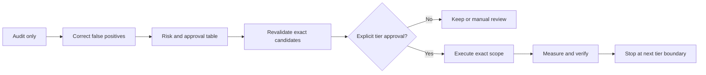

# Workflow

The workflow separates evidence collection, approval, execution, and verification.

## 1. Audit only

Record storage state, directory totals, large ordinary files, file-type totals, old-file indicators, empty directories, broken links, and likely temporary material. Do not label a file unnecessary solely because it is old or large.

## 2. Correct the inventory

Before counting duplicates:

- exclude dependencies, virtual environments, package libraries, worktrees, application bundles, managed libraries, database storage, and caches outside scope;
- group by byte size, then hash content cryptographically;
- record device and inode;
- count hard-linked names separately from independent copies;
- avoid following links or crossing onto other volumes.

## 3. Build the approval table

Each candidate needs an identifier, exact private target, evidence, logical and allocated size, expected physical recovery, risk, retained copy or regeneration method, quarantine plan, rollback, and unresolved concerns.

Only the non-identifying summary belongs in this public repository.

## 4. Revalidate immediately before action

Confirm the target still exists, remains within the approved filesystem, has not changed materially, and still passes every exclusion. Recheck the owning process just before execution.

## 5. Execute the exact scope

Record the command before running it. An action must be constrained to the approved target and must not generalize to a parent cache or directory.

## 6. Verify

Measure both:

- target-level logical and allocated changes; and
- whole-volume free and used space.

Record swap separately. APFS metadata, compression, clones, snapshots, and background writes can make the two measurements differ.

## 7. Stop

Complete the run report and stop at the next approval boundary. A proposal for the next tier is not authorization to execute it.
